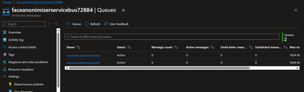
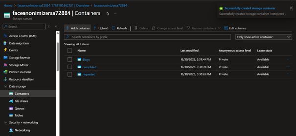
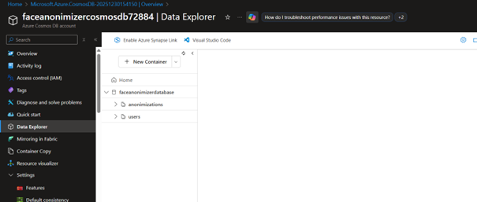
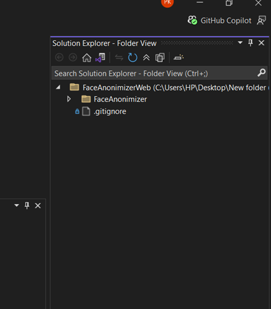
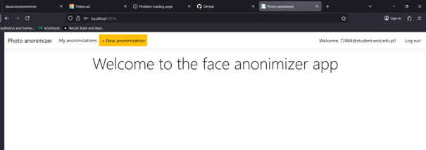
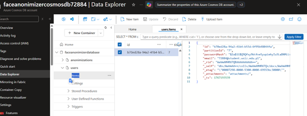

# Azure Cloud Technologies Labs - Full-Stack Portfolio ☁️

This repository documents my end-to-end technical journey through Microsoft Azure, evolving from foundational data storage to advanced event-driven architectures and a final "Face-Anonymizer" integrated solution.

---

## Cloud Foundations: Introduction to Azure
Before diving into the technical labs, this portfolio establishes a baseline in **Cloud Computing**. Unlike traditional on-premise infrastructure, Microsoft Azure provides **PaaS (Platform as a Service)** and **Serverless** models. These allow developers to focus on writing code and managing data without worrying about hardware maintenance, electricity, or physical security.

---

## Curriculum Overview

| Lab | Title | Core Objective | Primary Services Used |
| :--- | :--- | :--- | :--- |
| **Lab 01** | **Scalable Data Storage** | Implement hybrid storage for NoSQL metadata and unstructured files. | Cosmos DB, Blob Storage |
| **Lab 02** | **Running Applications** | Deploy PaaS web apps and implement deep cloud observability. | App Service, App Insights, Functions |
| **Lab 03** | **Integrating Applications** | Decouple system components using asynchronous messaging queues. | Service Bus, Logic Apps, .NET API |
| **Lab 04** | **The Face-Anonymizer** | Build a serverless, event-driven image processing pipeline. | Full Azure Stack Integration |

---

## Lab 01: Scalable Data Storage in Azure

### **Understanding Azure Storage**
In this lab, I implemented two distinct types of cloud storage to handle different data needs:
1. **Azure Blob Storage:** Used for *Unstructured Data*. It functions like a massive file system in the cloud. I utilized **Containers** to store images and files.
2. **Azure Cosmos DB:** Used for *Structured NoSQL Data*. Unlike traditional tables, Cosmos DB allows for flexible JSON schemas, making it perfect for high-speed metadata tracking.

<b>📂 View Full Implementation Details (10 Screenshots)</b>

| Step | Technical Description | Visual Evidence |
| :--- | :--- | :---: |
| **01** | **Cosmos DB Provisioning:** Initializing the globally distributed NoSQL database account. |  |
| **02** | **Resource Overview:** Monitoring the deployment and health status of the Cosmos DB instance. |  |
| **03** | **Data Explorer:** Accessing the SQL API interface to manage collections and documents. |  |
| **04** | **Container Creation:** Defining the 'Songs' collection with specific partition keys for scaling. |  |
| **05** | **Document Entry:** Manually inserting JSON records to verify database write capability. |  |
| **06** | **JSON Schema:** Validating the data structure and metadata for application song entries. |  |
| **07** | **Storage Provisioning:** Creating a general-purpose v2 storage account for file hosting. |  |
| **08** | **Blob Containers:** Setting up the internal folder structure for image and file storage. |  |
| **09** | **Blob Properties:** Configuring access tiers (Hot/Cool) and security settings for assets. |  |
| **10** | **Final Storage View:** Verifying the successful creation of all storage infrastructure. |  |

> **Conclusion:** By the end of this lab, I successfully bridged the gap between file storage and database management. I learned that choosing the right storage type (Blob vs. NoSQL) is critical for cost-efficiency and performance. I successfully demonstrated the ability to provision, secure, and query data within the Azure ecosystem.

---

##  Lab 02: Running Applications & Observability

<b>📂 View Full Implementation Details (19 Screenshots)</b>

| Step | Technical Description | Visual Evidence |
| :--- | :--- | :---: |
| **01** | **App Service Setup:** Provisioning the web host for the "Psotify" API. |  |
| **02** | **Deployment Center:** Linking the source code repository for automated deployments. |  |
| **03** | **Env Variables:** Configuring connection strings for database integration. |  |
| **04** | **Deployment Logs:** Verifying the successful build and release of the web app. |  |
| **05** | **Live Endpoint:** Accessing the public URL to confirm the API is responsive. |  |
| **06** | **CPU/RAM Metrics:** Monitoring infrastructure performance under initial load. |  |
| **07** | **Function Setup:** Creating serverless HTTP-triggered logic for the backend. |  |
| **08** | **Invocation Test:** Triggering the serverless function to verify back-end logic. |  |
| **09** | **Function Logs:** Observing real-time console output during execution. |  |
| **10** | **Logic App Flow:** Visualizing the automated workflow for background tasks. |  |
| **11** | **App Insights:** Configuring the main dashboard for service observability. |  |
| **12** | **Application Map:** Mapping dependencies between the web app and database. |  |
| **13** | **Failure Analysis:** Investigating "500 Internal Server Errors" in production. |  |
| **14** | **Exception Tracing:** Performing a deep dive into the code's stack trace. |  |
| **15** | **Live Metrics Stream:** Monitoring real-time telemetry from active users. |  |
| **16** | **Performance Testing:** Analyzing server response times across different regions. |  |
| **17** | **Log Streaming:** Directly tailing application logs via the Azure Portal. |  |
| **18** | **Health Checks:** Ensuring the platform remains available and responsive. |  |
| **19** | **Final Summary:** Reviewing the health of the entire application ecosystem. |  |

> **Conclusion:** This lab proved that deployment is only half the battle. By using **Azure App Service**, I moved my application from a local environment to a global URL. However, the most significant takeaway was mastering **Application Insights**. I learned to interpret stack traces and live metrics to identify a database connection failure, proving that a cloud engineer must be as skilled in troubleshooting as they are in development.

---

##  Lab 03: Integrating Applications

<b>📂 View Full Implementation Details (9 Screenshots)</b>

| Step | Technical Description | Visual Evidence |
| :--- | :--- | :---: |
| **01** | **Service Bus Namespace:** Establishing the messaging backbone for integration. |  |
| **02** | **Queue Configuration:** Defining the `newsongqueue` properties (TTL, size). |  |
| **03** | **Access Policies:** Configuring SAS tokens for secure app authentication. |  |
| **04** | **API Project:** Developing the .NET Core API to drop messages into the queue. |  |
| **05** | **Sender Logic:** Coding the connection between the app and the Service Bus. |  |
| **06** | **Local Debugging:** Running local tests to ensure messages reach the cloud. |  |
| **07** | **Logic App Designer:** Designing the workflow that listens to the queue. |  |
| **08** | **Trigger Params:** Setting the polling interval for the Service Bus trigger. |  |
| **09** | **Process Success:** Verifying that the backend consumed the message correctly. |  |

> **Conclusion:** I moved away from "Monolithic" design toward "Microservices." By implementing **Azure Service Bus**, I created a system where the front end and back end are decoupled. The major conclusion here is **Reliability**: even if the backend processor is temporarily down, the Service Bus Queue ensures no user data is lost.

---

##  Lab 04: The "Face-Anonymizer" (Final Capstone)

<b>📂 View Full Implementation Details (9 Screenshots)</b>

| Step | Technical Description | Visual Evidence |
| :--- | :--- | :---: |
| **01** | **Container Lifecycle:** Managing the 'requested' and 'completed' image blobs. |  |
| **02** | **Cosmos DB Logging:** Tracking the status of every anonymization request. |  |
| **03** | **Service Bus Monitor:** Monitoring the active traffic of request messages. |  |
| **04** | **Web Interface:** The user-facing portal for uploading target images. |  |
| **05** | **Solution Structure:** The final code hierarchy of the integrated project. |  |
| **06** | **Integration Logic:** The bridge code between storage and messaging. |  |
| **07** | **Queue Peak:** Verifying the background processing of incoming requests. |  |
| **08** | **Final Blob:** Confirming the anonymized image exists in 'completed'. |  |
| **09** | **Pipeline Success:** Final logs showing a 100% success rate for the pipeline. |  |

> **Conclusion:** This final project served as a cumulative validation of my Azure expertise. I successfully integrated **Storage, Messaging, and Compute** into a single event-driven pipeline. This proves my ability to architect complex, automated cloud solutions that solve real-world problems.

---

##  The Journey Continues
This repository represents my core Azure training, but it is only the beginning. As I continue my **MSc in Cybersecurity**, I will be adding more projects focused on **Cloud Security, DevSecOps, and Digital Forensics**.

**Stay tuned for more updates as I continue this journey!**

---

  
  
  
  

