# Azure Cloud Technologies Labs - Full-Stack Portfolio ☁️

This repository documents a comprehensive journey through Microsoft Azure, evolving from foundational data storage to advanced event-driven architectures and serverless application integration.

---

##  Lab 01: Scalable Data Storage in Azure
*Focus: NoSQL Databases and Blob Storage Management*

<b>📂 View Full Project Walkthrough (10 Screenshots)</b>

### **Phase 1: NoSQL Database (Cosmos DB) Setup**
| Step 1: Provisioning | Step 2: Resource Overview | Step 3: Data Explorer |
| :---: | :---: | :---: |
| 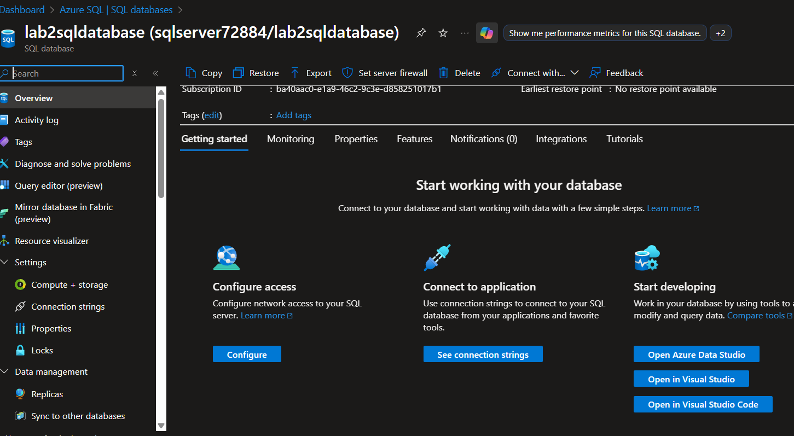 | 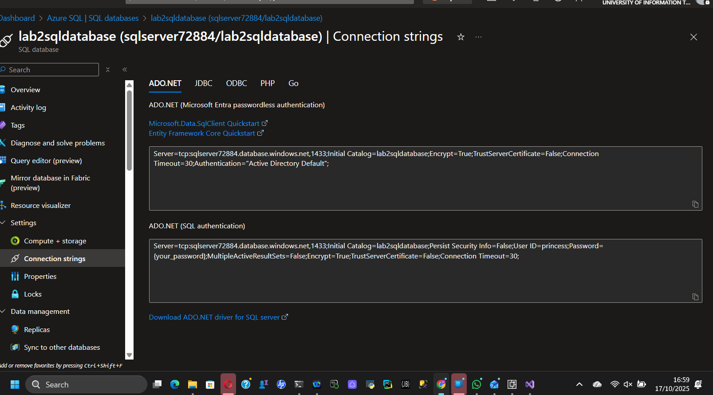 | 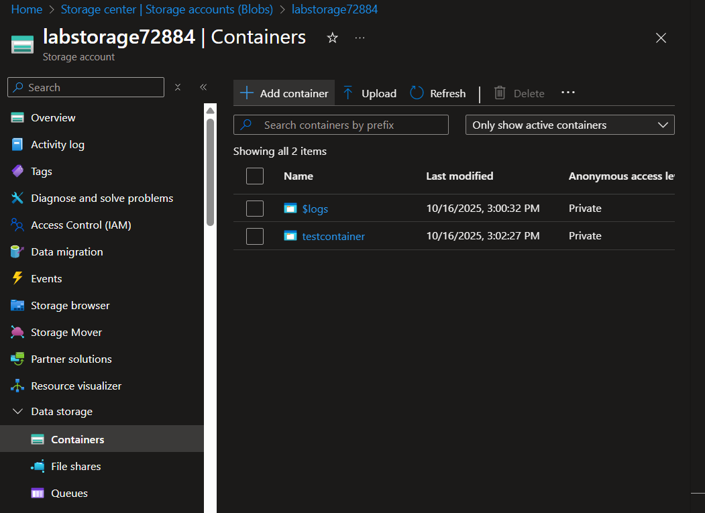 |
| *Creating the Cosmos DB account* | *Database dashboard & metrics* | *Accessing the SQL API interface* |

### **Phase 2: JSON Document & Schema Management**
| Step 4: Container Creation | Step 5: Item Entry | Step 6: JSON Structure |
| :---: | :---: | :---: |
| 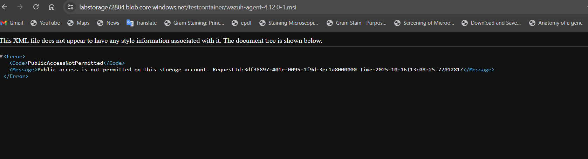 | 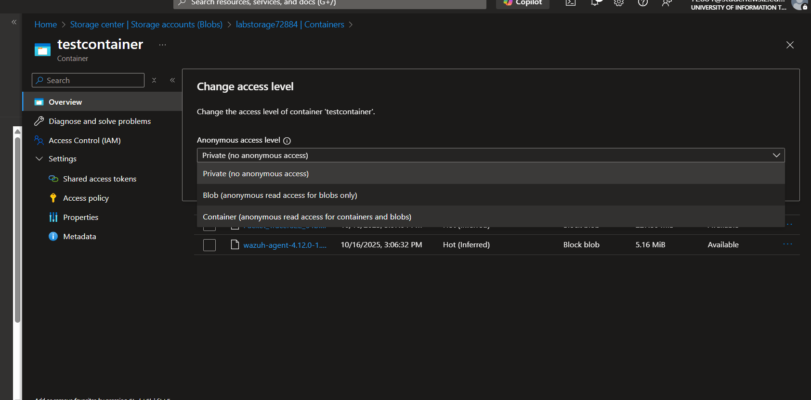 | 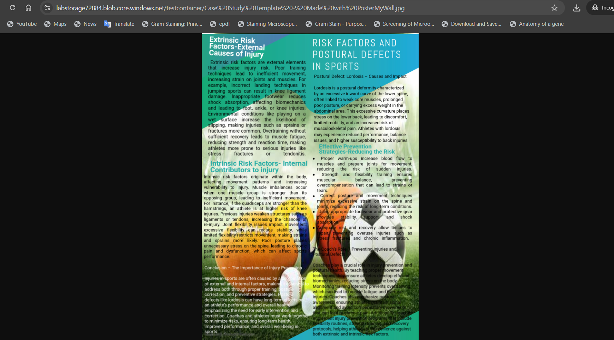 |
| *Defining the 'Songs' collection* | *Adding new data items* | *Verifying metadata schema* |

### **Phase 3: Blob Storage & File Management**
| Step 7: Storage Account | Step 8: Container Logic | Step 9: Access Tiers | Step 10: Final Verification |
| :---: | :---: | :---: | :---: |
|  | 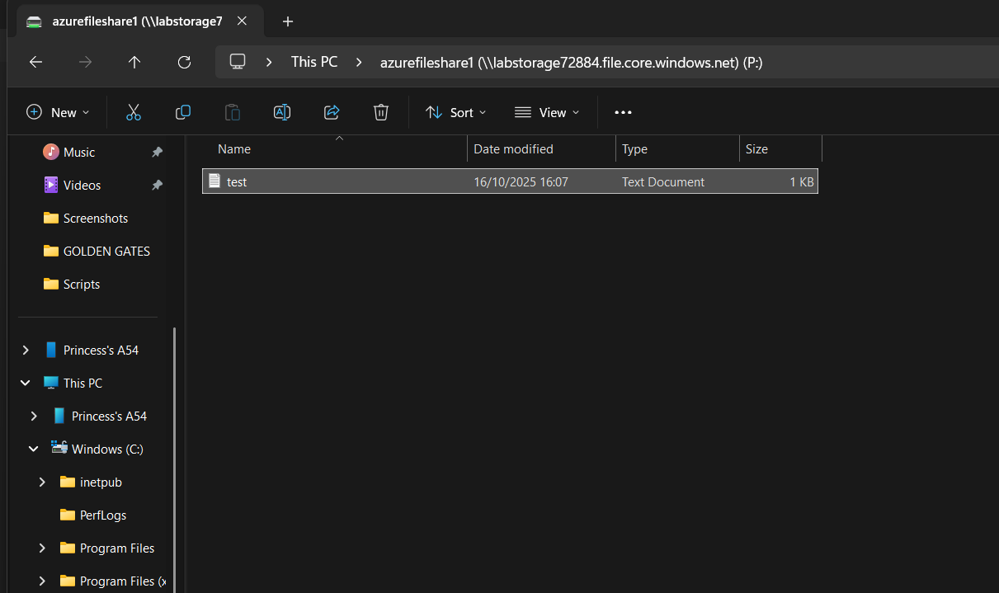 | 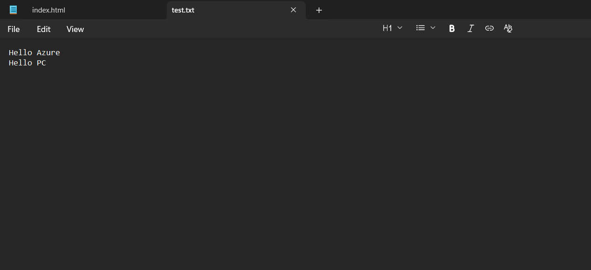 | 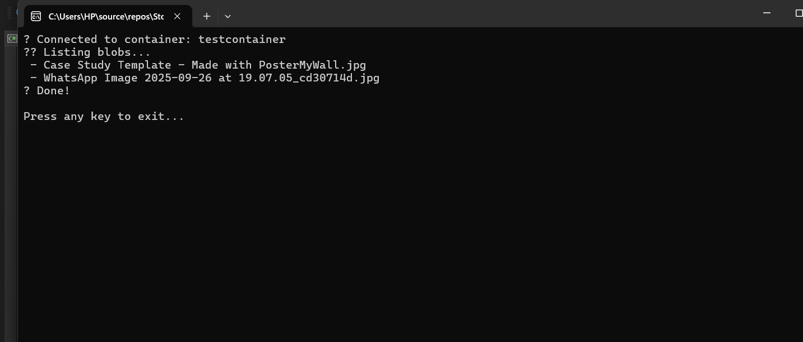 |
| *Provisioning storage* | *Creating image containers* | *Blob property settings* | *Successful storage deployment* |

**Key Takeaways:** * Successfully implemented **Cosmos DB** for high-velocity metadata storage.
* Managed unstructured data via **Azure Blob Storage** with dedicated containers for ingestion.
* Validated data integrity using the **Data Explorer** tool.

---

##  Lab 02: Running Applications in Azure
*Focus: PaaS Deployment, Serverless Functions, and Cloud Observability*

<b>📂 View Full Project Walkthrough (19 Screenshots)</b>

### **Phase 1: App Service & Infrastructure**
| Step 1: Resource Creation | Step 2: Deployment Center | Step 3: Config & Env Vars |
| :---: | :---: | :---: |
| 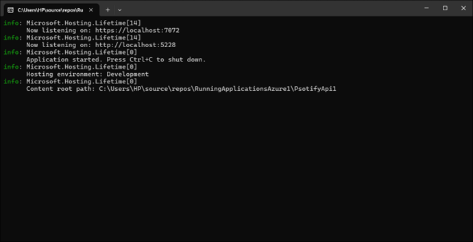 | 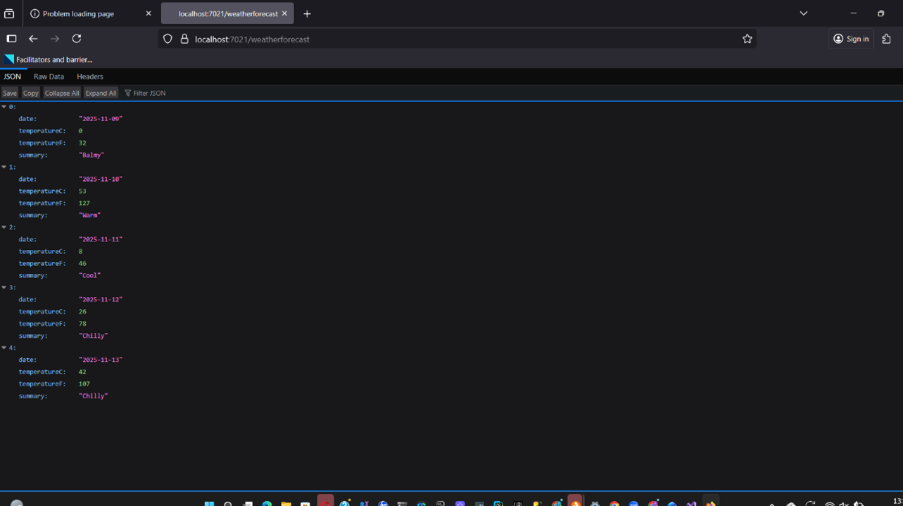 | 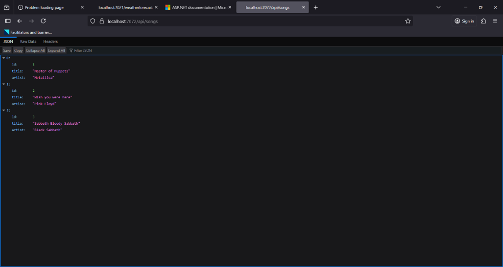 |
| *Provisioning Psotify Web App* | *Configuring GitHub CI/CD* | *Setting Connection Strings* |

### **Phase 2: Live Deployment & System Metrics**
| Step 4: Build Logs | Step 5: Web UI Access | Step 6: Service Metrics |
| :---: | :---: | :---: |
| 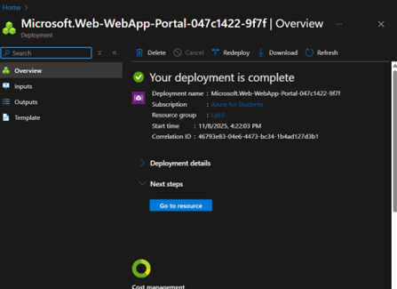 | 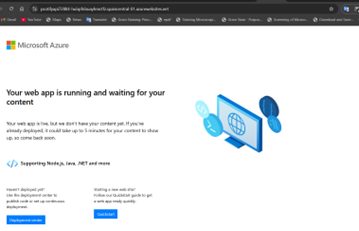 | 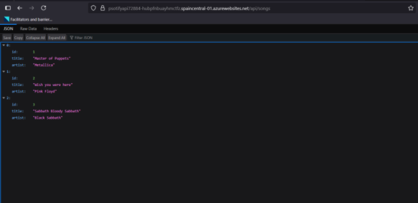 |
| *Build and deploy success* | *Live endpoint verification* | *Monitoring CPU/RAM usage* |

### **Phase 3: Serverless Logic & Function App**
| Step 7: Function Setup | Step 8: HTTP Triggers | Step 9: Code Execution |
| :---: | :---: | :---: |
| 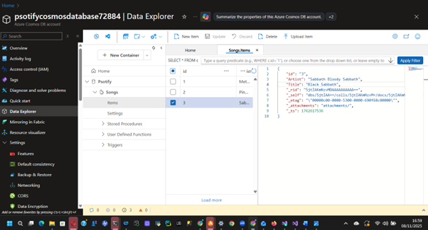 | 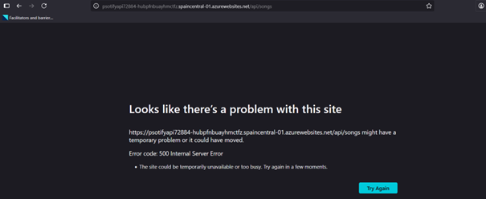 | 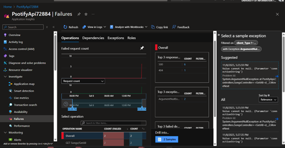 |
| *Building serverless logic* | *Testing backend calls* | *Verifying runtime output* |

### **Phase 4: Monitoring & Advanced Debugging**
| Step 10: Logic App Flow | Step 11: Application Insights | Step 12: Dependency Map |
| :---: | :---: | :---: |
| 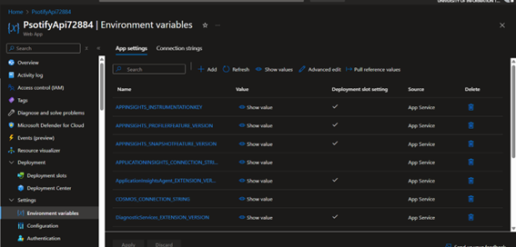 | 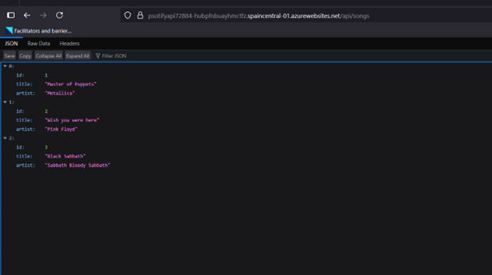 | 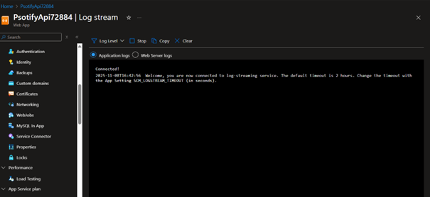 |
| *Visualizing workflows* | *Investigating health logs* | *Mapping service connections* |

| Step 13: Failure Analysis | Step 14: Exception Tracing | Step 15: Live Metrics |
| :---: | :---: | :---: |
| 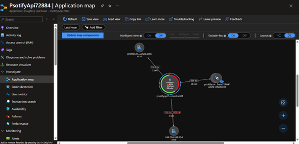 | 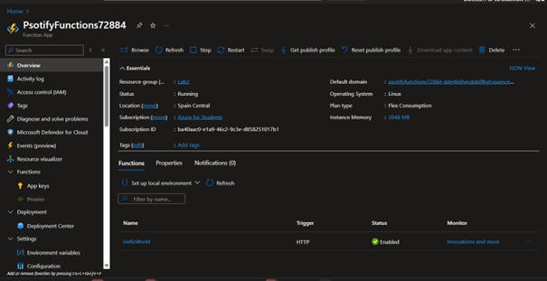 | 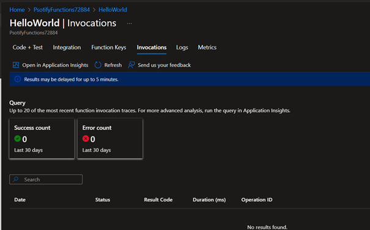 |
| *Analyzing 500 errors* | *Deep-dive into stack traces* | *Real-time telemetry* |

| Step 16: Performance | Step 17: Log Streaming | Step 18: Resource Health | Step 19: Final Status |
| :---: | :---: | :---: | :---: |
| 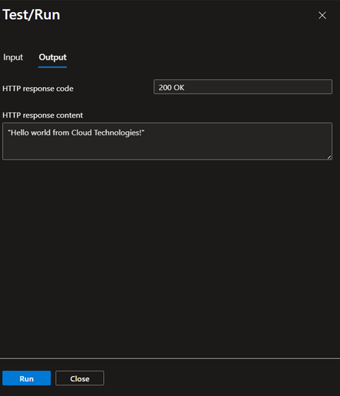 | 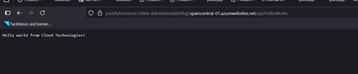 | 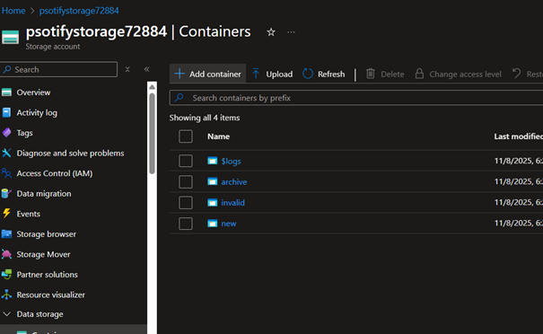 | 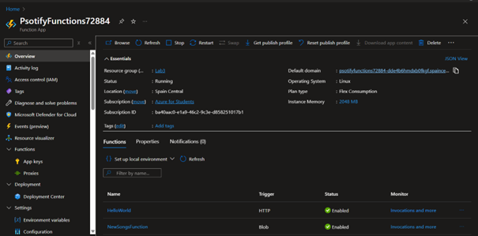 |
| *Measuring response times* | *Live console debugging* | *Availability tracking* | *Final deployment summary* |

---

##  Lab 03: Integrating Applications in Azure
*Focus: Asynchronous Messaging, Service Bus, and Decoupled Architecture*

<b>📂 View Full Project Walkthrough (9 Screenshots)</b>

### **Phase 1: Service Bus & Messaging Infrastructure**
| Step 1: Namespace Setup | Step 2: Queue Configuration | Step 3: Shared Access Policies |
| :---: | :---: | :---: |
| 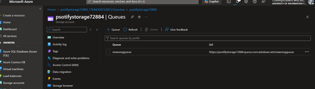 | 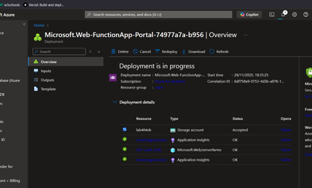 | 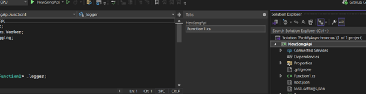 |
| *Provisioning Service Bus Namespace* | *Creating the 'newsongqueue'* | *Managing connection strings* |

### **Phase 2: API Development & Message Ingestion**
| Step 4: .NET API Setup | Step 5: Messaging Logic | Step 6: Local Debugging |
| :---: | :---: | :---: |
| 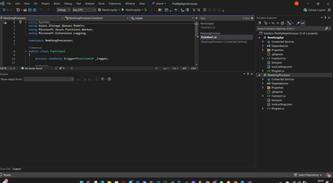 | 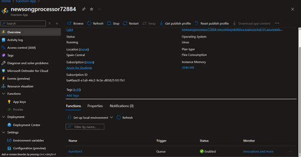 | 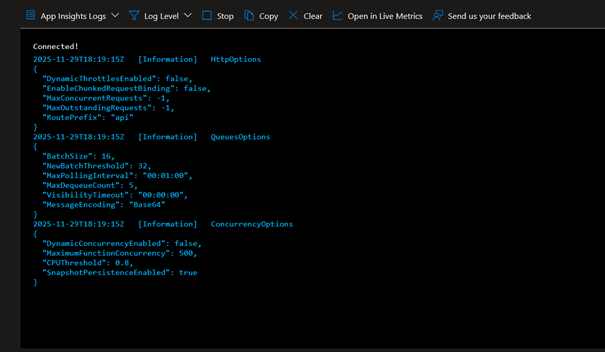 |
| *Configuring the NewSongApi* | *Writing the Queue client code* | *Testing endpoint connectivity* |

### **Phase 3: Logic Apps & Subscriber Verification**
| Step 7: Logic App Designer | Step 8: Trigger Configuration | Step 9: Execution Success |
| :---: | :---: | :---: |
| 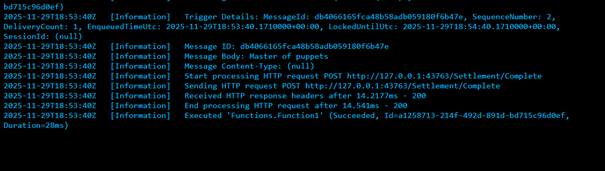 | 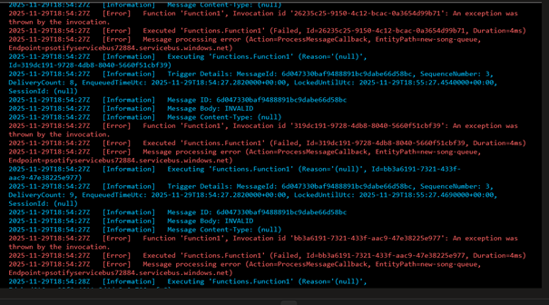 | 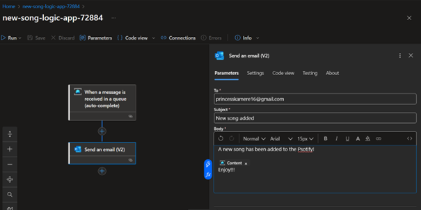 |
| *Designing automated workflows* | *Setting Service Bus triggers* | *Verifying end-to-end integration* |

**Key Takeaways:**
* **Decoupling:** Effectively separated the front-end API from backend processing using **Azure Service Bus**, ensuring that service failures in one tier do not crash the entire system.
* **Scalability:** Implemented a queue-based load leveling pattern to handle traffic spikes smoothly.
* **Automation:** Integrated **Azure Logic Apps** as a serverless listener to react instantly to new messages in the queue.

---

##  Lab 04: The "Face-Anonymizer" - Final Integration
*Focus: Full-Stack Integrated Cloud Solution*

<b>📂 View Full Project Walkthrough (10+ Screenshots)</b>

### **Final Project Workflow**
1. **Ingestion:** User-uploaded images are stored in a "requested" Blob container.
2. **Messaging:** An `anonymizationrequested` message is sent to the Service Bus Queue.
3. **Persistence:** User metadata and processing status are tracked in Azure Cosmos DB.
4. **Completion:** The processed image is moved to the "completed" container for retrieval.

| Step 1: Web Interface | Step 2: Queue Logic | Step 3: Storage Workflow |
| :---: | :---: | :---: |
|  | 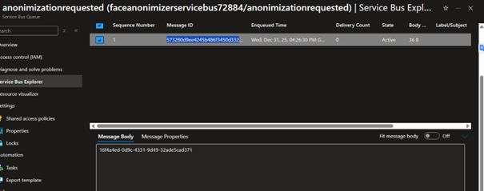 | 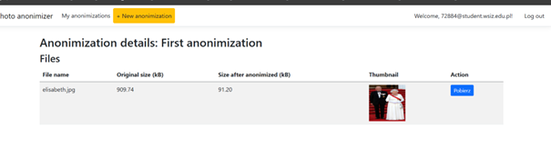 |
| *The Face-Anonymizer UI* | *Handling request messages* | *Blob lifecycle management* |

| Step 4: Cosmos DB Logs | Step 5: Solution Structure | Step 6: Final Verification |
| :---: | :---: | :---: |
|  |  | 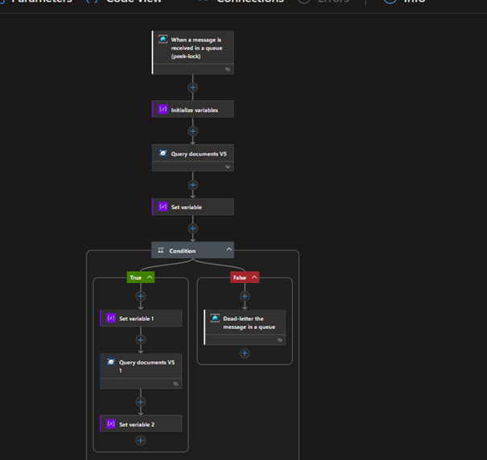 |
| *Anonymization metadata* | *Project file hierarchy* | *End-to-end system success* |

---

  

  <b>   | MSc Cybersecurity Candidate</b> 
  <i>Current Focus: Cloud Security, Serverless Architectures, and System Integration</i>

  

